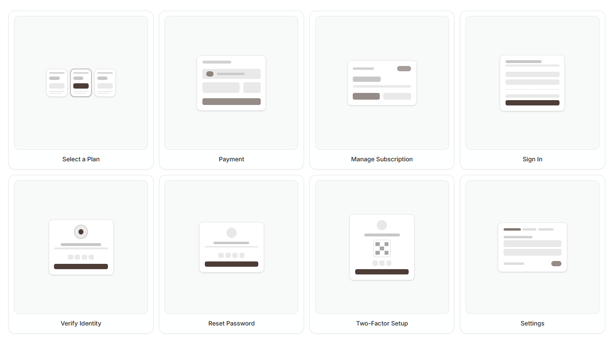

# Flexnative

Interfaces are decisions, not component collections.

From intent to interface.



Flexnative is an open source collection of UI intents, interface decisions, prompts, and patterns.

This repo documents the reasoning, prompts, and code behind reusable interface decisions.

Built on [shadcn/ui](https://ui.shadcn.com) and Tailwind CSS. Designed to be extended and owned.

Each intent maps to decisions with tradeoffs, then to prompts, patterns, and implementations.

- **Intent** — what the interface needs to achieve.
- **Decision** — the tradeoffs behind a solution.
- **Prompt** — instructions for builders and agents.
- **Pattern** — a reusable implementation.

**This repo is the open source project behind [ui.flexnative.com](https://ui.flexnative.com).**

## Documentation

Visit [ui.flexnative.com](https://ui.flexnative.com) to browse intents, decisions, prompts, patterns, blocks, and documentation.

## Development

```bash
npm run dev
npm run build
npm run registry:build
```

## Contributing

Please read the [contributing guide](/CONTRIBUTING.md).

## License

Licensed under the [AGPL-3.0 license](/LICENSE).
