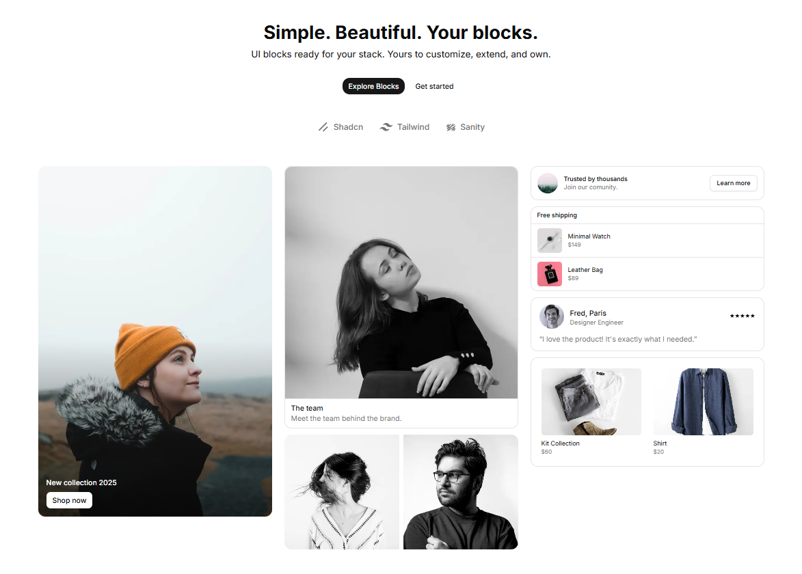

# Flx

Reusable UI blocks for building consistent, scalable interfaces.

Copy and paste every block. Customize and own every block. No lock-in, you stay in control.
Preview components with real props directly in the docs, and plug in Sanity if you need a CMS.

Built on [shadcn/ui](https://ui.shadcn.com).

## Documentation

Visit [ui.flexnative.com/docs](https://ui.flexnative.com/docs) for the full documentation, block reference, and examples.

## Contributing

Please read the [contributing guide](/CONTRIBUTING.md).

## License

Licensed under the [MIT license](/LICENSE.md).
