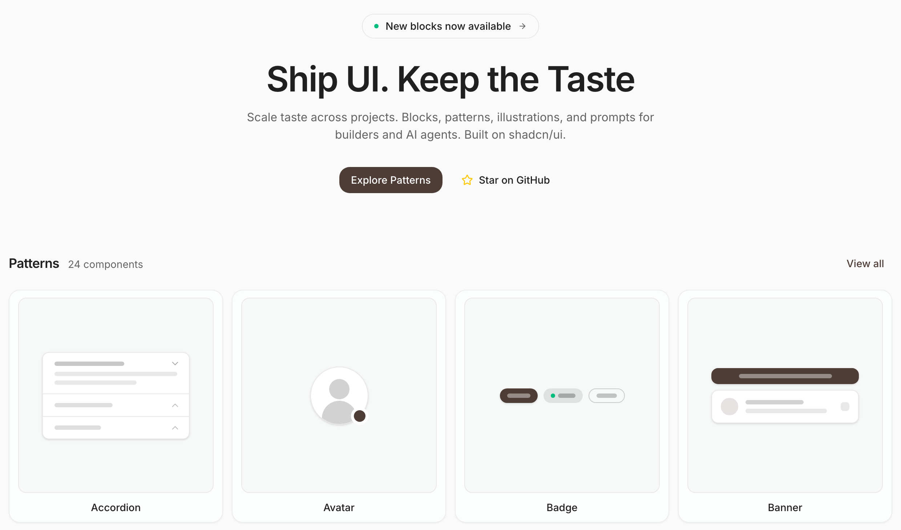

<div align="center">

# Flexnative

**shadcn/ui blocks, patterns and illustrations you paste and own.**

Open source blocks for landing pages and marketing sites, patterns for everyday UI and illustrations that bring them to life. Built on shadcn/ui and Tailwind CSS. Add them with one command, then the code is yours.

[Website](https://ui.flexnative.com) · [Blocks](https://ui.flexnative.com/blocks) · [Illustrations](https://ui.flexnative.com/illustrations) · [Patterns](https://ui.flexnative.com/patterns)




</div>

## Why Flexnative

Flexnative follows the [shadcn/ui](https://ui.shadcn.com) approach: instead of adding a dependency, you add the source to your project.

- **You own the code.** Every item lands in your project as plain React. Change anything.
- **Only shadcn/ui underneath.** Everything uses shadcn/ui components, Tailwind CSS and lucide-react icons. Nothing else to learn.
- **Themes and dark mode.** Colors come from your theme tokens, so everything matches the rest of your app.
- **Motion built in.** Animations use Motion, with support for reduced motion.
- **Works with AI agents.** Point Claude Code, Cursor or Codex to [llms.txt](https://ui.flexnative.com/llms.txt) and the `@flx` registry.

## Quick start

Flexnative is listed in the shadcn registry directory as `@flx`. In a project with shadcn/ui set up:

```bash
npx shadcn@latest add @flx/feature-01
```

Swap `feature-01` for any block, pattern or illustration name shown on the website. Prefer not to use the CLI? Every page has the source to copy by hand.

Using Claude Code, Cursor or Codex? Point your agent to [llms.txt](https://ui.flexnative.com/llms.txt).

Blocks are plain components with their content inline, so you can use one right away and edit the text, images and links in the file:

```tsx
import { Feature01 } from '@/components/flx/blocks/feature/feature-01'

export default function Page() {
  return <Feature01 />
}
```

## What's inside

### Blocks

Full page sections for landing pages and marketing sites.

| Category | |
| --- | --- |
| [Hero](https://ui.flexnative.com/blocks/hero) | The first section of a landing page |
| [Feature](https://ui.flexnative.com/blocks/feature) | Explain product capabilities |
| [Content](https://ui.flexnative.com/blocks/content) | Present information in an organized way |
| [Call to Action](https://ui.flexnative.com/blocks/cta) | Drive visitors toward a next step |
| [Testimonials](https://ui.flexnative.com/blocks/testimonials) | Social proof from customers |
| [Bento grids](https://ui.flexnative.com/blocks/bento-grids) | A primary tile with supporting cards |
| [Carousel](https://ui.flexnative.com/blocks/carousel) | Browsable media and cards |
| [Logos](https://ui.flexnative.com/blocks/logos) | A logo row for social proof |
| [Scroll](https://ui.flexnative.com/blocks/scroll) | Sticky media that changes as you scroll |

More categories are on the way.

### Patterns

Ready-made variations of shadcn/ui components for everyday UI, across 23 categories: accordion, avatar, badge, banner, breadcrumb, button, card, checkbox, collapsible, command, dialog, dropdown, empty, input, item, pagination, popover, select, skeleton, switch, table, tabs and tooltip. [Browse patterns](https://ui.flexnative.com/patterns).

Forms come in two flavors: [React Hook Form](https://ui.flexnative.com/forms/react-hook-form) and [TanStack Form](https://ui.flexnative.com/forms/tanstack-form).

### Illustrations

UI illustrations built with shadcn/ui and Motion, ready to drop into blocks, empty states and marketing pages.

- **Spot**: small, elegant UI elements such as metrics, notifications and charts.
- **Scene**: large, layered illustrations for hero and marketing sections.

[Browse illustrations](https://ui.flexnative.com/illustrations).

## Requirements

- A project with [shadcn/ui](https://ui.shadcn.com/docs/installation) set up, using the Base UI style
- React 19 and Tailwind CSS 4
- The [shadcn CLI](https://ui.shadcn.com/docs/cli) to install items, or nothing at all if you copy them by hand

## FAQ

**Is it free?**
Yes. Everything in `registry/` is MIT, so you can use it in any project, commercial or not.

**Does it work with my design?**
Yes. Everything reads your shadcn/ui theme tokens, so changing your theme changes them too.

## Development

This repo powers [ui.flexnative.com](https://ui.flexnative.com) and hosts the `@flx` registry.

```bash
pnpm install
pnpm dev
pnpm registry:build
```

Source lives in `registry/`, and `pnpm registry:build` generates the installable files in `public/r`. See [CONTRIBUTING.md](CONTRIBUTING.md) for the rules every item follows.

## Credits

Inspired by [shadcn/ui](https://ui.shadcn.com). Built by [Felipe Menezes](https://x.com/fmenezes_).

If Flexnative saves you time, a star helps other developers find it.

## License

The blocks, patterns, forms, illustrations and presets in [`registry/`](registry) are licensed under the [MIT license](registry/LICENSE). Use them in any project, commercial or not.

Everything else in this repository, including the website, is licensed under the [AGPL-3.0 license](LICENSE).
